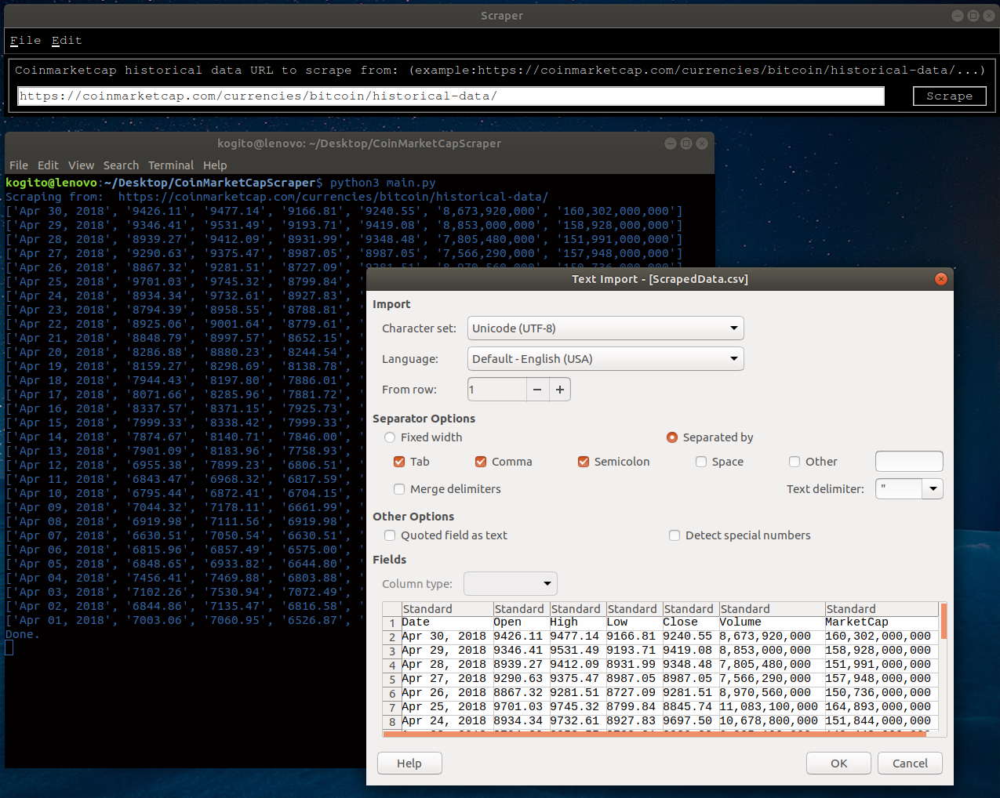

# CoinMarketCapScraper
a lightweight python scraper to get/scrape historical data from the CoinMarketCap website and convert it into a csv file. This is an initial step for a data mining process to develop a predictive model of cryptocurrencies prices. This code is built with python 3.

## Getting Started
These instructions will get you a copy of the project up and running on your local machine for development and testing purposes. 

### Prerequisites
In order to excute this code you will need the following python 3 packages:
* [tkinter](https://docs.python.org/3/library/tkinter.html) module
```
sudo apt-get install python3-tk
```
* [BeautifulSoup](https://pypi.org/project/beautifulsoup4/) module
```
sudo pip install beautifulsoup4
```
* [requests](https://docs.python-requests.org/en/master/) module
```
sudo pip install requests
```

## Tests
This code has been only tested on ubuntu 16.04

## Deployment
This code can be either excuted using a python IDE or by running the following command in the terminal:
```
python3 main.py
```
## Screenshots


## Built With
* [Spyder3](http://pythonhosted.org/spyder/)

## Contributing
If you have any improvement's suggestions, please contact me.

## License
This project is licensed under the MIT License - see the [LICENSE.md](LICENSE.md) file for details

## Acknowledgments
* The nameless heros of Stackoverflow
